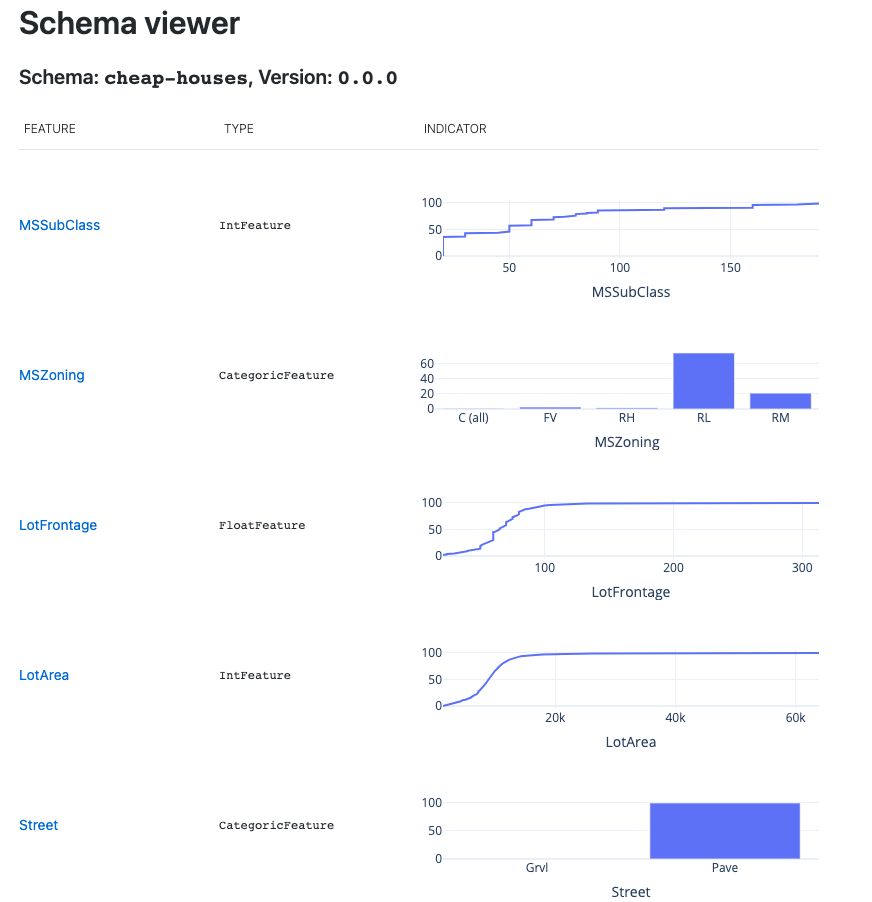
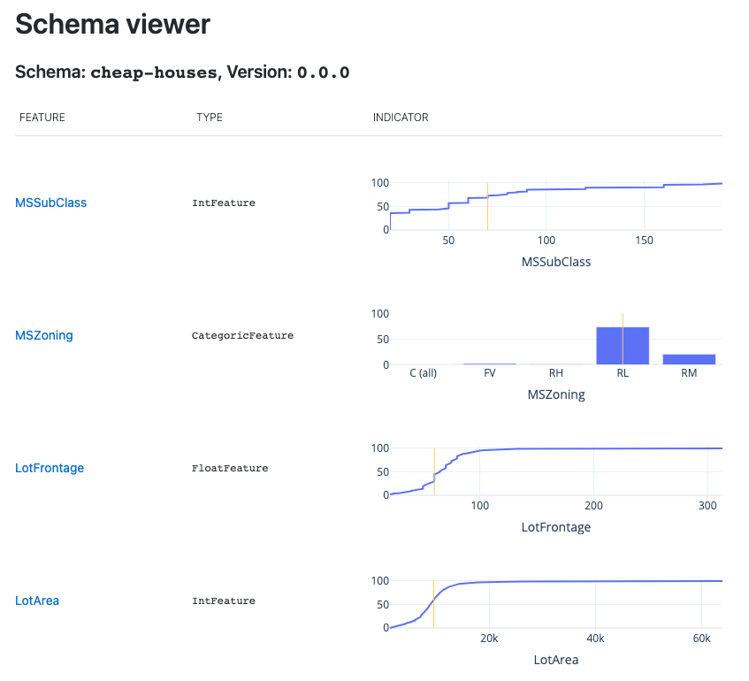
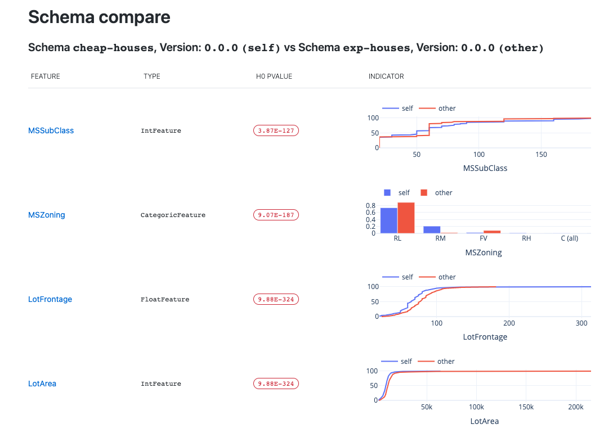

# Raymon Data Validation Library

[](https://github.com/psf/black)
<a href="https://github.com/raymon-ai/data-validation/blob/master/LICENSE.md"></a>
<a href="#"></a>

## At a glance
RDV allows you to easily specify data schemas at train time, to be used to validate production data.
  

## What?
RDV (Raymon Data Validation) is a library to validate data in ML / AI systems. Checking whether incoming data is according to expectations is important because invalid data may be processed by the system without the system failing, resulting in unreliable results. RDV integrates with the rest of the [Raymon.ai](https://raymon.ai) system, but can be used standalone and is open source.

RDV provides currently offers (limited) out-of-the-box data validation functionality for structured and vision data. The goal is to extend this functionality and to provide a flexible framework where users can plug in their own components. An overview of available functionality and the roadmap can be found below. Additional features to bo added to the roadmap can be requested in the [issues](https://github.com/raymon-ai/data-validation/issues).

## Why?
As a data scientist, you are responsible for the correctness and reliability of your systems. However, this correctness not only deplends on how good you or your team can apply fancy algorithms, but also on the data your system receives from clients. This data can be corrupted, distributions may have changed since training your model (data drift) or the relationship between features and targets may have changed (concept drift / covariate shift). 'Bad' data might be processed without raising errors, but the results will be unreliable and less accurate (model drift). RDV basially offers you a framework to easiliy validate your data and predictions so that bad data can be surfaced, owners cna be notified and approriate action can be taken.


## Installation and Usage

### Installation
RDV can be installed from PyPI

```pip install rdv```

### Schema building

Let's take the example of structured data. Creating a schema for a certain dataframe (for example your train or test set) goes as follows:
```python
import pandas as pd
from rdv.schema import Schema
from rdv.feature import construct_features

# Load some data
cheap_data = pd.read_csv("./data_sample/subset-cheap.csv").drop("Id", axis="columns")
# Build a schema
schema = Schema(name="cheap-houses", features=construct_features(cheap_data.dtypes))
schema.build(data=cheap_data)
# Save it
schema.save("schema-cheap.json")
```
### Checking data
Validating a data points goes like this:
```python
schema.check(cheap_data.iloc[0, :])
```
Which will output a list of tags, which can be the feature values or data errors. These tags can be pushed to the Raymon.ai backend, to be used as metrics for monitoring.
```python
[{'type': 'schema-feature',
  'name': 'MSSubClass',
  'value': 70.0,
  'group': 'cheap-houses@0.0.0'},
 {'type': 'schema-feature',
  'name': 'MSZoning',
  'value': 'RL',
  'group': 'cheap-houses@0.0.0'},
  # This is an error: teh "Alley" feature is NaN
 {'type': 'schema-error',
  'name': 'Alley-err',
  'value': 'Value NaN',
  'group': 'cheap-houses@0.0.0'},
  ...
]
```

### Viewing schema
Data schemas can be visualized for inspection too:
```python
schema.view()
```
This will open an interactive dash app, looking like this:


### Viewing a specific POI
```python
schema.view(poi=cheap_data.iloc[0, :])

```
This will also open an interactive dash app, looking as follows. Notice the yellow indicators indicating the current poi.


### Comparing schemas
RDV also allows you to compare 2 schemas.

```python
exp_data = pd.read_csv("./data_sample/subset-exp.csv").drop("Id", axis="columns")
schema_exp = Schema(name="exp-houses", features=construct_features(data.dtypes))
schema_exp.build(data=exp_data)

schema.compare(schema_exp)
```


## How?
- A schema is composed out of multiple features.
- These features are calculated from data by feature extractors. The simplest case is selecting a certain feature from structured data like in the example above, but this can be any feature extractor like an image sharpness, or an outlier score.
- Every schema feature stores a reference to this feature extractor. 
- When building a schema, the specified feature is extracted from all data points and statistics about this feature (min, max, mean, distribution) are saved in a `Stats` object, which is saved in every feature component of the schema.


